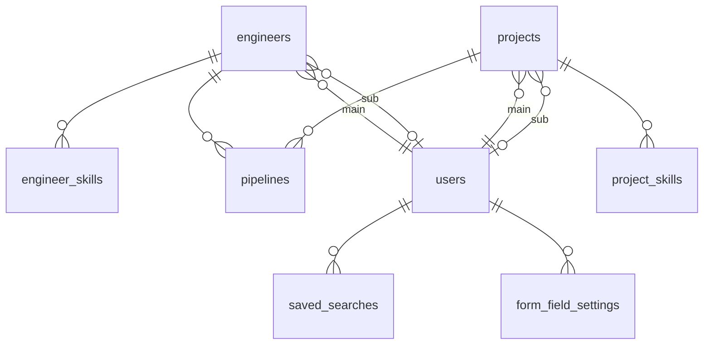

# データモデル・DB設計書

**システム名：** Nexus  
**作成日：** 2026-05-10  
**最終更新：** 2026-08-05  
**作成者：** 岡大貴  
**ステータス：** 基本設計中

## 目次

1. [設計方針・前提](#1-設計方針前提)
2. [テーブル一覧](#2-テーブル一覧)
3. [ER図](#3-er図)
4. [テーブル定義](#4-テーブル定義)
5. [インデックス定義](#5-インデックス定義)
6. [列挙値・選択肢定義](#6-列挙値選択肢定義)
7. [削除ルール](#7-削除ルール)
8. [一覧画面のソート仕様](#8-一覧画面のソート仕様)

-----

## 1. 設計方針・前提

### 1-1. MatchResultを独立エンティティとしない

QA #45 にて「オンデマンド計算（DB保存なし）」が確定済み。マッチングスコアは実行のたびに **Python AI エンジンがリアルタイムで総合判定**し、その結果はDBに保存しない。

> **【v1.7 修正】スコアリングロジックの変更（WF_09 v2.0 確定）**  
> WF_09 が v2.0 にアップデートされ、スコアリングロジックが**ルールベース8項目からAI総合判定に変更**された。  
> - スコアは 100 点満点で AI が総合判定する（ランク定義：A≥80 / B65〜79 / C50〜64 / D≤49 は維持）  
> - 旧来のルールベース8項目の配点テーブルは廃止。ドロワー内「スコア内訳」は「AIスコア算出理由（テキスト）」に変更済み  
> - 各テーブルカラムの備考欄に記載していた「スコアリング対象」は、AI が判定時に参照する**入力パラメータ**であることを意味する（配点に直接対応するわけではない）  

マッチング結果からパイプラインへ追加した時点のスコア・ランク・AIスコア算出理由・AI推薦コメント・不足条件のみ、**pipelines テーブルに直接カラムとして保持する**（追加時点のスナップショット）。

### 1-2. 必須/任意はDBスキーマではなくアプリ層で制御する

QA #65・#82 にて確定。必須/任意の制御は form_field_settings テーブルの値に従いアプリ層で行う。

NULLの考え方：

- **システム固定必須**（氏名/カナ、案件名）：DBレベルでもNOT NULLとする
- **それ以外の全カラム**：DBレベルではNULLを許容し、必須/任意の制御はアプリ層で行う

**form_field_settings 変更時の遅延バリデーション適用ポリシー**

運用中に「任意」から「必須」へ設定変更した場合、既存データ（DBにNULLが保存されているもの）に対するバッチマイグレーションは行わない。

- **過去データのNULLはそのまま放置する**
- 対象レコードを次回編集・更新しようとした時点で、現在の必須ルールが適用される
- ユーザーは必須項目を入力してはじめて更新できる

> **ポリシー定義：** 過去のデータであっても、今後更新を行う際は現在の必須ルールに従ってデータを埋めることをユーザーに義務付ける。

### 1-3. 勤務形態（案件側）はENUMカラムで管理する

案件の稼働形態は単一選択のため、`projects.work_style` に ENUM カラムを持つ。人材側の勤務形態希望は複数選択のため §1-8 に従いカラムで管理する。

### 1-4. テーブル数の増加による性能影響はない

このシステムの規模（社内ツール・同時アクセス数人〜十数人）ではテーブル数が性能に直結しない。性能を左右するのはクエリごとのアクセスパターンとインデックス設計であり、応答目標（一覧3秒以内・詳細2秒以内：QA #27確定）は達成できる。

### 1-5. 削除方針

engineers・projects・users・pipelines はすべて物理削除のみとする。

- **一般営業**：engineers は status を `not_proposable`、projects は status を `closed` に変更することでクローズ扱いとする。これは論理削除ではなくステータス管理であり、レコード自体はDBに残り続ける。
- **管理者**：物理DELETE のみ実施可能。論理削除カラム（`deleted_at`）は設けない。

### 1-6. 操作ログテーブルは設けない

QA #21・#55・#57・#58 にて不要と確定。

### 1-7. パイプライン担当営業の設計方針（QA #83 確定）

パイプラインカードに表示する担当営業は `engineers.main_user_id` を参照する。pipelines テーブルへのFKカラム追加は不要。

### 1-8. 工程経験・勤務形態はカラムで管理する（中間テーブル不採用）

QA #78 にて工程経験（6種）・勤務形態（3種）の選択肢は将来の追加なし・固定確定。

カラム方式を採用する（詳細は v1.6 §1-8 参照）。

**工程経験カラム（engineers / projects 共通の6列）：**

```
proc_requirements  TINYINT(1) NULL DEFAULT NULL
proc_basic_design  TINYINT(1) NULL DEFAULT NULL
proc_detail_design TINYINT(1) NULL DEFAULT NULL
proc_development   TINYINT(1) NULL DEFAULT NULL
proc_testing       TINYINT(1) NULL DEFAULT NULL
proc_maintenance   TINYINT(1) NULL DEFAULT NULL
```

**人材の勤務形態希望カラム（engineers の3列）：**

```
work_style_onsite  TINYINT(1) NULL DEFAULT NULL
work_style_hybrid  TINYINT(1) NULL DEFAULT NULL
work_style_remote  TINYINT(1) NULL DEFAULT NULL
```

> 1 = あり / 0 = なし（NULL はCSV取り込み時の空欄に限る）  
> 案件側の勤務形態は単一選択のため `projects.work_style ENUM` をそのまま維持する。

### 1-9.【v1.7 新規】一覧クエリにおける TEXT カラム非取得ガイドライン

`engineers` テーブルは v1.6 のカラム統合で30カラム超えの幅広テーブルになっており、以下の TEXT 型カラムを含む。

| カラム名 | 概要 |
|---------|------|
| `appeal_note` | アピールポイント（長文テキスト） |
| `ai_summary` | AI職歴要約（生成テキスト） |
| `remarks` | 特記事項（長文テキスト） |

WF_03（人材一覧）ではこれらの TEXT カラムは表示されない。`SELECT *` を使うと一覧表示のたびに不要なデータ転送が発生するため、以下の方針を徹底すること。

- **一覧エンドポイント**（`GET /api/engineers`）：TEXT カラムを返さない。Eloquent Resource で明示的に除外する。
- **詳細エンドポイント**（`GET /api/engineers/{id}`）：全カラムを返してよい。
- 同様のルールを `projects` テーブルの `description TEXT` / `work_env TEXT` / `remarks TEXT` / `billing_range VARCHAR` にも適用する。

-----

## 2. テーブル一覧

| # | テーブル名（物理） | 論理名 | 概要 | 主キー | 備考 |
|---|---|---|---|---|---|
| 1 | engineers | 人材 | 人材のプロフィール・スキル・希望条件・工程経験・勤務形態を管理する | id | |
| 2 | projects | 案件 | SES案件の要件・条件・就業環境・対象工程を管理する | id | |
| 3 | pipelines | 進捗管理 | 人材×案件の提案〜成約パイプラインを管理する | id | `(engineer_id, project_id)` にUNIQUE制約 |
| 4 | users | ユーザー | 社内営業担当者アカウントを管理する | id | 物理削除のみ |
| 5 | engineer_skills | 人材スキル | 人材のスキルをフリーテキスト（ラベル＋詳細）で管理する | id | |
| 6 | project_skills | 案件スキル | 案件の必須・尚可スキルをフリーテキスト（ラベル＋詳細）で管理する | id | `skill_type` で必須/尚可を区別 |
| 7 | form_field_settings | フォーム設定 | 登録フォームの必須/任意をトグル管理する設定テーブル | id | `(form_type, field_key)` にUNIQUE制約 |
| 8 | saved_searches | 保存済み検索条件 | ユーザーの保存済み検索条件を管理する | id | |

-----

## 3. ER図

> **表示方法：** 本図は Mermaid `erDiagram` 記法で記述。GitHub / VS Code（Markdown Preview Mermaid Support 等）でグラフィカルに表示される。



> **工程経験・勤務形態：** §1-8 の設計方針に従い、中間テーブルを設けず `engineers` / `projects` のカラムとして直接保持する。  
> **担当営業：** `engineers.main_user_id` / `sub_user_id`・`projects.main_user_id` / `sub_user_id` で直接参照。中間テーブルは設けない。WF_04 / WF_07 にてサブは1名まで確定。  
> **パイプライン担当営業（QA #83 確定）：** 進捗管理画面では `pipelines.engineer_id → engineers.main_user_id → users` の経路で担当者を参照する。  
> **保存済み検索条件（saved_searches）：** `user_id` は FK `ON DELETE CASCADE`。個人保存・共有機能なし（QA #81 確定）のため、ユーザーが削除されると紐づく保存済み検索条件も連動して自動削除される。`main_user_id`（RESTRICT）とは異なり、アプリ層での事前チェックは不要。

-----

## 4. テーブル定義

### engineers（人材）

| 論理項目名 | カラム名（案） | 型 | NULL | キー | DEFAULT | 備考 |
|---|---|---|---|---|---|---|
| ID | id | BIGINT UNSIGNED | NOT NULL | PK | - | AUTO_INCREMENT |
| 氏名 | name | VARCHAR(100) | NOT NULL | | なし（要指定） | システム固定必須 |
| 氏名カナ | name_kana | VARCHAR(100) | NOT NULL | | なし（要指定） | システム固定必須 |
| 生年月日 | birth_date | DATE | NULL | | NULL | 年齢は生年月日から自動計算。form_field_settings で制御 |
| 最寄駅 | nearest_station | VARCHAR(100) | NULL | | NULL | フリーテキスト入力。QA #59 確定 |
| 路線 | nearest_line | VARCHAR(100) | NULL | | NULL | |
| 稼働可能時期 | available_from | DATE | NULL | | NULL | AIマッチング入力パラメータ |
| 顧客折衝経験の有無 | has_negotiation_exp | TINYINT(1) | NULL | | NULL | 1=有 / 0=無。AIマッチング入力パラメータ |
| 希望単価（月額・万円） | desired_rate | SMALLINT UNSIGNED | NULL | | NULL | AIマッチング入力パラメータ |
| アピールポイント | appeal_note | TEXT | NULL | | NULL | AI入力元。**一覧クエリでは取得しないこと（§1-9 参照）** |
| 特記事項 | remarks | TEXT | NULL | | NULL | AI非参照。**一覧クエリでは取得しないこと（§1-9 参照）** |
| ステータス | status | ENUM | NOT NULL | | `proposable` | 提案可 / 面談中 / 提案不可。QA #69 確定。→ §6-1 |
| AI職歴要約テキスト | ai_summary | TEXT | NULL | | NULL | `appeal_note` を入力元としてAI生成。再生成可能なためNULL許容。**一覧クエリでは取得しないこと（§1-9 参照）** |
| **AI要約最終生成日時** | **ai_summary_generated_at** | **DATETIME** | **NULL** | | **NULL** | **【v1.7 追加】WF_05「最終生成：YYYY-MM-DD」表示対応。AI要約生成時のみ更新。updated_at と分離することで要約の鮮度を管理できる** |
| メイン担当営業 | main_user_id | BIGINT UNSIGNED | NOT NULL | FK | なし（要指定） | → users.id。ON DELETE RESTRICT |
| サブ担当営業 | sub_user_id | BIGINT UNSIGNED | NULL | FK | NULL | → users.id。ON DELETE SET NULL |
| 要件定義経験 | proc_requirements | TINYINT(1) | NULL | | NULL | 1=あり / 0=なし（NULL はCSV取り込み時の空欄に限る）。AIマッチング入力パラメータ。→ §6-2 |
| 基本設計経験 | proc_basic_design | TINYINT(1) | NULL | | NULL | 1=あり / 0=なし（NULL はCSV取り込み時の空欄に限る）。AIマッチング入力パラメータ。→ §6-2 |
| 詳細設計経験 | proc_detail_design | TINYINT(1) | NULL | | NULL | 1=あり / 0=なし（NULL はCSV取り込み時の空欄に限る）。AIマッチング入力パラメータ。→ §6-2 |
| 開発経験 | proc_development | TINYINT(1) | NULL | | NULL | 1=あり / 0=なし（NULL はCSV取り込み時の空欄に限る）。AIマッチング入力パラメータ。→ §6-2 |
| テスト経験 | proc_testing | TINYINT(1) | NULL | | NULL | 1=あり / 0=なし（NULL はCSV取り込み時の空欄に限る）。AIマッチング入力パラメータ。→ §6-2 |
| 保守運用経験 | proc_maintenance | TINYINT(1) | NULL | | NULL | 1=あり / 0=なし（NULL はCSV取り込み時の空欄に限る）。AIマッチング入力パラメータ。→ §6-2 |
| 常駐可 | work_style_onsite | TINYINT(1) | NULL | | NULL | 1=あり / 0=なし（NULL はCSV取り込み時の空欄に限る）。AIマッチング入力パラメータ。→ §6-3 |
| 一部リモート可 | work_style_hybrid | TINYINT(1) | NULL | | NULL | 1=あり / 0=なし（NULL はCSV取り込み時の空欄に限る）。AIマッチング入力パラメータ。→ §6-3 |
| フルリモート希望 | work_style_remote | TINYINT(1) | NULL | | NULL | 1=あり / 0=なし（NULL はCSV取り込み時の空欄に限る）。AIマッチング入力パラメータ。→ §6-3 |
| 作成日時 | created_at | DATETIME | NOT NULL | | CURRENT_TIMESTAMP | |
| 更新日時 | updated_at | DATETIME | NOT NULL | | CURRENT_TIMESTAMP | Eloquentが自動更新 |

> **除外確定項目：** 顔写真（QA #46）、所属区分（QA #60）、通勤許容時間（QA #61）、職務経歴ファイルパス（WF_04 v2.0・前田様確認）はカラムとして持たない。

-----

### projects（案件）

| 論理項目名 | カラム名（案） | 型 | NULL | キー | DEFAULT | 備考 |
|---|---|---|---|---|---|---|
| ID | id | BIGINT UNSIGNED | NOT NULL | PK | - | AUTO_INCREMENT |
| 案件名 | name | VARCHAR(255) | NOT NULL | | なし（要指定） | システム固定必須 |
| 顧客名 | client_name | VARCHAR(100) | NULL | | NULL | 通常の顧客名は50文字以内。案件名（VARCHAR(255)）と意図的に差別化 |
| 募集人数 | headcount | TINYINT UNSIGNED | NULL | | NULL | |
| 参画開始時期 | start_date | DATE | NULL | | NULL | AIマッチング入力パラメータ |
| 単価下限（月額・万円） | rate_min | SMALLINT UNSIGNED | NULL | | NULL | AIマッチング入力パラメータ |
| 単価上限（月額・万円） | rate_max | SMALLINT UNSIGNED | NULL | | NULL | AIマッチング入力パラメータ |
| 単価備考 | rate_note | VARCHAR(100) | NULL | | NULL | 「スキル見合い、応相談」等の短文。QA #14 確定。rate_min/rate_max が NULL の場合 AI はこのテキストを参考情報として扱う（配点加算なし） |
| 商流 | commercial_flow | ENUM | NULL | | NULL | プライム / 2次 / 3次 / その他。QA #80 確定。→ §6-7 |
| 稼働形態 | work_style | ENUM | NULL | | NULL | フルリモート / 一部リモート可 / 常駐。（NULL はCSV取り込み時の空欄に限る）AIマッチング入力パラメータ。→ §6-3 |
| 勤務地（路線名） | work_location_line | VARCHAR(100) | NULL | | NULL | 常駐・一部リモート時のみ入力 |
| 勤務地（最寄駅） | work_location_station | VARCHAR(100) | NULL | | NULL | 常駐・一部リモート時のみ入力。AIマッチング入力パラメータ |
| 面談回数 | interview_count | TINYINT UNSIGNED | NULL | | NULL | |
| 顧客折衝経験要否 | negotiation_required | TINYINT(1) | NULL | | NULL | 1=要 / 0=不問。AIマッチング入力パラメータ |
| 業務内容詳細 | description | TEXT | NULL | | NULL | AI総合判定の主要参照テキスト。**一覧クエリでは取得しないこと（§1-9 参照）** |
| 稼働環境 | work_env | TEXT | NULL | | NULL | フリーテキスト。QA #67 確定。**一覧クエリでは取得しないこと（§1-9 参照）** |
| 精算幅 | billing_range | VARCHAR(100) | NULL | | NULL | フリーテキスト。QA #66 確定 |
| 特記事項 | remarks | TEXT | NULL | | NULL | AI非参照。**一覧クエリでは取得しないこと（§1-9 参照）** |
| ステータス | status | ENUM | NOT NULL | | `open` | 募集中 / 終了 / ペンディング。QA #79 確定。→ §6-6 |
| メイン担当営業 | main_user_id | BIGINT UNSIGNED | NOT NULL | FK | なし（要指定） | → users.id。ON DELETE RESTRICT |
| サブ担当営業 | sub_user_id | BIGINT UNSIGNED | NULL | FK | NULL | → users.id。ON DELETE SET NULL |
| 要件定義対象 | proc_requirements | TINYINT(1) | NULL | | NULL | 1=あり / 0=なし（NULL はCSV取り込み時の空欄に限る）。AIマッチング入力パラメータ。→ §6-2 |
| 基本設計対象 | proc_basic_design | TINYINT(1) | NULL | | NULL | 1=あり / 0=なし（NULL はCSV取り込み時の空欄に限る）。AIマッチング入力パラメータ。→ §6-2 |
| 詳細設計対象 | proc_detail_design | TINYINT(1) | NULL | | NULL | 1=あり / 0=なし（NULL はCSV取り込み時の空欄に限る）。AIマッチング入力パラメータ。→ §6-2 |
| 開発対象 | proc_development | TINYINT(1) | NULL | | NULL | 1=あり / 0=なし（NULL はCSV取り込み時の空欄に限る）。AIマッチング入力パラメータ。→ §6-2 |
| テスト対象 | proc_testing | TINYINT(1) | NULL | | NULL | 1=あり / 0=なし（NULL はCSV取り込み時の空欄に限る）。AIマッチング入力パラメータ。→ §6-2 |
| 保守運用対象 | proc_maintenance | TINYINT(1) | NULL | | NULL | 1=あり / 0=なし（NULL はCSV取り込み時の空欄に限る）。AIマッチング入力パラメータ。→ §6-2 |
| 作成日時 | created_at | DATETIME | NOT NULL | | CURRENT_TIMESTAMP | |
| 更新日時 | updated_at | DATETIME | NOT NULL | | CURRENT_TIMESTAMP | Eloquentが自動更新 |

-----

### pipelines（進捗管理）

パイプラインカードはマッチング結果経由でのみ生成される（手動追加不可。QA #43 にて確定）。

**① 案件あたりの上限（進行中アクティブ5件）**：1案件に追加できる**進行中（アクティブ）**パイプラインの上限は5件（QA #50 にて確定。アプリ層で制御）。上限は「進行中のパイプライン数」で判定し、終了済みステータス（terminal：不成立・見送り等）は枠を消費しない。すなわち、ある人材の進捗が終了すると案件のアクティブ枠が1つ空き、**別の（未追加の）人材**を新たに追加できる。※表示件数の「上位5件」とは別概念。

**② 同一人材×同一案件は一度きり（UNIQUE）**：`(engineer_id, project_id)` の UNIQUE 制約（`uk_pipelines_engineer_project`）により、**同一人材を同一案件へ二重に追加することはできない**。この制約はステータスに関わらず有効なため、その人材のパイプラインが終了済みになっても、**同じ人材を同じ案件へ再追加することはできない**（①で空くのはあくまで他人材向けの枠）。

| 論理項目名 | カラム名（案） | 型 | NULL | キー | DEFAULT | 備考 |
|---|---|---|---|---|---|---|
| ID | id | BIGINT UNSIGNED | NOT NULL | PK | - | AUTO_INCREMENT |
| 人材ID | engineer_id | BIGINT UNSIGNED | NOT NULL | FK | なし（要指定） | → engineers.id。ON DELETE CASCADE |
| 案件ID | project_id | BIGINT UNSIGNED | NOT NULL | FK | なし（要指定） | → projects.id。ON DELETE CASCADE |
| ステータス | status | ENUM | NOT NULL | | `proposed` | → §6-4。QA #49 確定（初期値）。※QA #62 未確定（業務定義） |
| マッチングスコア（追加時） | match_score | TINYINT UNSIGNED | NULL | | NULL | 0〜100。追加時スナップショット（AI総合判定値） |
| マッチングランク（追加時） | match_rank | CHAR(1) | NULL | | NULL | A / B / C / D。追加時スナップショット |
| AIスコア算出理由（追加時） | ai_score_reason | TEXT | NULL | | NULL | 追加時スナップショット |
| AI推薦コメント（追加時） | ai_comment | TEXT | NULL | | NULL | 追加時スナップショット |
| 不足条件（追加時） | ai_missing | TEXT | NULL | | NULL | 追加時スナップショット |
| 顧客コメント | client_comment | TEXT | NULL | | NULL | QA #54 確定 |
| NG理由 | ng_reason | TEXT | NULL | | NULL | QA #54 確定 |
| 次回アクション予定日 | next_action_date | DATE | NULL | | NULL | アラート機能不要。QA #54 確定。QA #6 確定 |
| 終了日時 | ended_at | DATETIME | NULL | | NULL | 終了ステータスへ遷移したタイミングでアプリ層から記録（`ended_at = now()`）。進行中ステータスの場合はNULL。完了済みタブの「終了日」列として表示する |
| 作成日時 | created_at | DATETIME | NOT NULL | | CURRENT_TIMESTAMP | |
| 更新日時 | updated_at | DATETIME | NOT NULL | | CURRENT_TIMESTAMP | Eloquentが自動更新 |

> **複合ユニーク制約：** `(engineer_id, project_id)` にUNIQUE制約を設け、同一人材×案件の重複追加を防ぐ。  
> **ステータス遷移（QA #4 確定）：** 前のステータスへ戻す操作も許可。ただし**終了ステータスへの遷移は不可逆**（QA #64 確定）。アプリ層でガード処理を実装する。  
> **完了済みカードの表示（QA #5 確定）：** 終了ステータスのカードは「完了済みタブ」で一覧表示する（WF_10 v16.2確認）。

-----

### users（ユーザー）

| 論理項目名 | カラム名（案） | 型 | NULL | キー | DEFAULT | 備考 |
|---|---|---|---|---|---|---|
| ID | id | BIGINT UNSIGNED | NOT NULL | PK | - | AUTO_INCREMENT |
| 氏名 | name | VARCHAR(100) | NOT NULL | | なし（要指定） | QA #68 確定 |
| メールアドレス | email | VARCHAR(255) | NOT NULL | UQ | なし（要指定） | ログインID。社内メールのみ。QA #19 確定 |
| パスワード（ハッシュ） | password | VARCHAR(255) | NOT NULL | | なし（要指定） | bcrypt等でハッシュ化 |
| ロール | role | ENUM('admin','general') | NOT NULL | | `general` | admin / general。QA #17 確定。→ §6-5 |
| ログイン状態保持トークン | remember_token | VARCHAR(100) | NULL | | NULL | WF_01「ログイン情報を保存する」チェックボックス対応。Laravel Breeze の `$table->rememberToken()` で生成。未チェック時は NULL。 |
| 最終ログイン日時 | last_login_at | DATETIME | NULL | | NULL | ログイン成功時にイベント/リスナー（Loginイベント）で自動更新。新規ユーザー追加直後・未ログイン時は NULL。 |
| 作成日時 | created_at | DATETIME | NOT NULL | | CURRENT_TIMESTAMP | |
| 更新日時 | updated_at | DATETIME | NOT NULL | | CURRENT_TIMESTAMP | Eloquentが自動更新 |

> パスワードリセットは管理者が手動で再設定する運用（QA #20 確定）。  
> アカウントのCRUDは管理者のみが実施（QA #16 確定）。  
> 登録項目は氏名・メールアドレス・パスワード・権限の4項目（QA #18 確定）。  
> **論理削除なし。物理削除のみ**（マスタ管理画面から管理者が実施）。  
> **`email_verified_at` は設けない。** 社内ツール・管理者によるアカウント発行運用のためメール認証フローは不要。Breezeが生成する User モデルから `MustVerifyEmail` の実装・casts の `email_verified_at` を削除すること。

-----

### engineer_skills（人材スキル）

スキル入力はフリーテキスト方式（WF_04 v2.0 確定）。

| カラム名（案） | 型 | NULL | キー | DEFAULT | 備考 |
|---|---|---|---|---|---|
| id | BIGINT UNSIGNED | NOT NULL | PK | - | AUTO_INCREMENT |
| engineer_id | BIGINT UNSIGNED | NOT NULL | FK | なし（要指定） | → engineers.id。ON DELETE CASCADE |
| **label** | **VARCHAR(15)** | **NULL** | | **NULL** | **【v1.7 追加】スキルラベル（最大15文字）。一覧・マッチング結果にタグ表示。project_skills と対称。form_field_settings で制御** |
| **detail** | **VARCHAR(500)** | **NULL** | | **NULL** | **【v1.7 追加】AIマッチング判定の参考情報。project_skills と対称。UIが1行テキスト（input）のため TEXT から変更。UI側に maxlength="500" を設定すること** |
| **created_at** | **DATETIME** | **NOT NULL** | | **CURRENT_TIMESTAMP** | **【v1.7 追加】全テーブル一律追加** |
| **updated_at** | **DATETIME** | **NOT NULL** | | **CURRENT_TIMESTAMP** | **【v1.7 追加】Eloquentが自動更新** |

> **スコアリングへの影響：** スコアリングが AI 総合判定に変更されたため（§1-1）、label のテキストは AI が参照するパラメータとして扱われる。Pythonチームと入力フォーマット（label のみか label+detail かの別）を確認すること。

-----

### project_skills（案件スキル）

`project_required_skills` と `project_preferred_skills` を統合。`skill_type` で必須/尚可を区別する。スキル入力はフリーテキスト方式（WF_07 v2.0 確定）。

| カラム名（案） | 型 | NULL | キー | DEFAULT | 備考 |
|---|---|---|---|---|---|
| id | BIGINT UNSIGNED | NOT NULL | PK | - | AUTO_INCREMENT |
| project_id | BIGINT UNSIGNED | NOT NULL | FK | なし（要指定） | → projects.id。ON DELETE CASCADE |
| **skill_type** | **ENUM('required','preferred')** | **NOT NULL** | | なし（要指定） | **【v1.7 追加】§6-8 の列挙値定義と整合。必須スキル / 尚可スキルを区別。インデックス `idx_project_skills_skill_type` 対応** |
| label | VARCHAR(15) | NULL | | NULL | スキルラベル（最大15文字）。一覧・マッチング結果にタグ表示。form_field_settings で制御 |
| detail | VARCHAR(500) | NULL | | NULL | AIマッチング判定の参考情報。UIが1行テキスト（input）のため VARCHAR(500) に設定。UI側に maxlength="500" を設定すること |
| created_at | DATETIME | NOT NULL | | CURRENT_TIMESTAMP | |
| updated_at | DATETIME | NOT NULL | | CURRENT_TIMESTAMP | Eloquentが自動更新 |

> **INDEX：** `(project_id)` ・ `(skill_type)` にそれぞれINDEXを設ける

-----

### form_field_settings（フォーム設定マスタ）

管理者がフォームの必須/任意をトグルで動的変更するための設定テーブル（QA #65・#82 確定）。

| カラム名（案） | 型 | NULL | キー | DEFAULT | 備考 |
|---|---|---|---|---|---|
| id | BIGINT UNSIGNED | NOT NULL | PK | - | AUTO_INCREMENT |
| form_type | ENUM('engineer','project') | NOT NULL | | なし（要指定） | engineer / project |
| field_key | VARCHAR(100) | NOT NULL | | なし（要指定） | フィールドを識別するキー |
| is_required | TINYINT(1) | NOT NULL | | 0 | 1=必須 / 0=任意。管理者が変更可能 |
| is_system_required | TINYINT(1) | NOT NULL | | 0 | 1=システム固定必須（管理者も変更不可） |
| updated_by | BIGINT UNSIGNED | NULL | FK | NULL | → users.id。最終変更ユーザー。ON DELETE SET NULL |
| created_at | DATETIME | NOT NULL | | CURRENT_TIMESTAMP | |
| updated_at | DATETIME | NOT NULL | | CURRENT_TIMESTAMP  | Eloquentが自動更新 |

> **複合ユニーク制約：** `(form_type, field_key)`

（初期シードデータは v1.6 から変更なし。省略）

-----

### saved_searches（保存済み検索条件）

| カラム名（案） | 型 | NULL | キー | DEFAULT | 備考 |
|---|---|---|---|---|---|
| id | BIGINT UNSIGNED | NOT NULL | PK | - | AUTO_INCREMENT |
| user_id | BIGINT UNSIGNED | NOT NULL | FK | なし（要指定） | → users.id。**ON DELETE CASCADE**。個人保存・共有機能なし。QA #81 確定 |
| name | VARCHAR(100) | NOT NULL | | なし（要指定） | ユーザーが任意に命名 |
| search_type | ENUM('engineer','project') | NOT NULL | | なし（要指定） | engineer / project |
| conditions | JSON | NOT NULL | | なし（要指定） | 検索パラメータをJSONシリアライズして保存 |
| created_at | DATETIME | NOT NULL | | CURRENT_TIMESTAMP | |
| updated_at | DATETIME | NOT NULL | | CURRENT_TIMESTAMP | Eloquentが自動更新 |

-----

## 5. インデックス定義

> **方針：** PRIMARY KEY はすべてのテーブルで設定済み（§4 各テーブル定義参照）。以下は明示的に設けるSECONDARY INDEX および UNIQUE 制約の一覧。

| テーブル | インデックス名 | カラム | 種別 | 用途 |
|---|---|---|---|---|
| engineers | idx_engineers_status | status | INDEX | ステータスフィルタ |
| engineers | idx_engineers_available_from | available_from | INDEX | 稼働可能時期ソート・AIマッチング入力 |
| engineers | idx_engineers_main_user_id | main_user_id | INDEX | 担当営業での絞り込み |
| engineers | **idx_engineers_sub_user_id** | **sub_user_id** | **INDEX** | **【v1.7 追加】サブ担当でのOR条件絞り込み対応。WF_02・WF_10 の「メイン・サブ含む自分担当」表示（QA #70確定）で `WHERE main_user_id = ? OR sub_user_id = ?` が発生するため必要** |
| projects | idx_projects_status | status | INDEX | ステータスフィルタ |
| projects | idx_projects_start_date | start_date | INDEX | 参画開始時期ソート・AIマッチング入力 |
| projects | idx_projects_main_user_id | main_user_id | INDEX | 担当営業での絞り込み |
| projects | **idx_projects_sub_user_id** | **sub_user_id** | **INDEX** | **【v1.7 追加】案件一覧の担当フィルタでOR条件が発生した場合に対応（engineers と同様の理由）** |
| pipelines | uk_pipelines_engineer_project | (engineer_id, project_id) | UNIQUE | 同一人材×案件の重複追加防止 |
| pipelines | idx_pipelines_engineer_id | engineer_id | INDEX | 人材IDでの絞り込み |
| pipelines | idx_pipelines_project_id | project_id | INDEX | 案件IDでの絞り込み |
| pipelines | idx_pipelines_status | status | INDEX | ステータスフィルタ |
| pipelines | idx_pipelines_next_action_date | next_action_date | INDEX | ダッシュボード近日アクション表示 |
| users | uk_users_email | email | UNIQUE | ログインID重複防止 |
| engineer_skills | idx_engineer_skills_engineer_id | engineer_id | INDEX | 人材IDでの絞り込み |
| engineer_skills | **idx_engineer_skills_label** | **label** | **INDEX** | **【v1.7 追加】スキルキーワード検索（前方一致 LIKE 'Java%' のみインデックス有効）。部分一致（LIKE '%Java%'）はインデックス不使用・フルスキャンとなる。社内ツール規模（数百〜数千件）では許容範囲と判断。件数増加時は FULLTEXT INDEX への移行を検討する。この判断を ADR に記録すること** |
| project_skills | idx_project_skills_project_id | project_id | INDEX | 案件IDでの絞り込み |
| project_skills | idx_project_skills_skill_type | skill_type | INDEX | 必須/尚可の絞り込み |
| form_field_settings | uk_form_field_settings | (form_type, field_key) | UNIQUE | フォーム種別×フィールドキーの重複防止 |
| saved_searches | idx_saved_searches_user_id | user_id | INDEX | ユーザーIDでの絞り込み |

-----

## 6. 列挙値・選択肢定義

### 6-1. engineers.status

| 値 | 表示名 |
|---|---|
| `proposable` | 提案可 |
| `interviewing` | 面談中 |
| `not_proposable` | 提案不可 |

（QA #69 確定）

### 6-2. 工程経験カラム（engineers / projects 共通）

QA #78 にて固定確定。将来の追加なし。§1-8 の設計方針に従い TINYINT(1) カラムで管理する。

| カラム名 | 論理名 | 値 |
|---|---|---|
| proc_requirements | 要件定義 | 1=あり / 0=なし（NULL はCSV取り込み時の空欄に限る） |
| proc_basic_design | 基本設計 | 1=あり / 0=なし（NULL はCSV取り込み時の空欄に限る） |
| proc_detail_design | 詳細設計 | 1=あり / 0=なし（NULL はCSV取り込み時の空欄に限る） |
| proc_development | 開発 | 1=あり / 0=なし（NULL はCSV取り込み時の空欄に限る） |
| proc_testing | テスト | 1=あり / 0=なし（NULL はCSV取り込み時の空欄に限る） |
| proc_maintenance | 保守運用 | 1=あり / 0=なし（NULL はCSV取り込み時の空欄に限る） |

### 6-3. 勤務形態

QA #78 にて固定確定。将来の追加なし。

**人材側（engineers）：複数選択可。§1-8 の設計方針に従い TINYINT(1) カラムで管理する。**

| カラム名 | 論理名 | 値 |
|---|---|---|
| work_style_onsite | 常駐可 | 1=あり / 0=なし（NULL はCSV取り込み時の空欄に限る） |
| work_style_hybrid | 一部リモート可 | 1=あり / 0=なし（NULL はCSV取り込み時の空欄に限る） |
| work_style_remote | フルリモート希望 | 1=あり / 0=なし（NULL はCSV取り込み時の空欄に限る） |

**案件側（projects.work_style）：単一選択。ENUM カラムで管理する。**

| 値 | 表示名 |
|---|---|
| `onsite` | 常駐 |
| `hybrid` | 一部リモート可 |
| `remote` | フルリモート |

### 6-4. pipelines.status

**進行中（12種）**（QA #2 確定）

| 値（案） | 表示名 | カンバングループ |
|---|---|---|
| `proposed` | 上位提案 | エントリー |
| `applied_by_candidate` | 求職者応募済み | エントリー |
| `applying` | 応募中 | エントリー |
| `first_scheduling` | 一次調整中 | 一次選考 |
| `first_waiting` | 一次待ち | 一次選考 |
| `first_result_waiting` | 一次結果待ち | 一次選考 |
| `final_scheduling` | 最終調整中 | 最終選考 |
| `final_waiting` | 最終待ち | 最終選考 |
| `final_result_waiting` | 最終結果待ち | 最終選考 |
| `offered` | オファー | オファー |
| `assign_waiting` | アサイン承諾待ち | オファー |
| `contracted` | 成約 | オファー |

> **【2026-07-02 変更】カンバン第1グループ名：** 「応募前」→「**エントリー**」（内部キー `applying_before`→`entry`）。「応募前」は中身（求職者応募済み・応募中）と矛盾していたため、提案〜応募のエントリーフェーズを表す名称へ変更（進捗管理実装 `.steering/20260702-pipeline-management/` にて確定）。  
> **初期ステータス（QA #49 確定）：** パイプラインへ追加した時点の初期ステータスは `proposed`（上位提案）。  
> **ステータス遷移制約（QA #4 確定）：** 前後スキップ・巻き戻しともに許可。ただし終了ステータスへの遷移後は不可逆。  
> **各ステータスの業務定義：** ※QA #62 未確定（未着手）。確定後に追記する。

**終了（4種）**（QA #63 確定）

| 値（案） | 表示名 | 業務定義 |
|---|---|---|
| `rejected` | 不成立 | 選考落選 |
| `closed` | 募集終了 | 案件側クローズ（発注取消・充足） |
| `assign_declined` | アサイン辞退 | 成約後にエンジニアがアサインを辞退 |
| `declined` | 辞退 | 選考途中でエンジニアが辞退 |

> **終了ステータスへの遷移は不可逆**（QA #64 確定）。アプリ層でガード処理を実装する。  
> **完了済みカードの表示（QA #5 確定）：** 終了ステータスのカードは「完了済みタブ」に一覧表示する（WF_10 v16.2確認）。

### 6-5. users.role

| 値 | 表示名 | 権限概要 |
|---|---|---|
| `admin` | 管理者 | 全機能 + マスタ管理 + アカウント管理 |
| `general` | 一般営業 | 通常営業機能のみ |

（QA #17 確定）

> **進捗管理の表示範囲（QA #70 確定）：** ログインユーザーがメイン・サブのいずれかで担当している人材のパイプラインカードを初期表示する。

### 6-6. projects.status（QA #79 確定）

| 値 | 表示名 |
|---|---|
| `open` | 募集中 |
| `closed` | 終了 |
| `pending` | ペンディング |

### 6-7. projects.commercial_flow（QA #80 確定）

| 値 | 表示名 |
|---|---|
| `prime` | プライム |
| `secondary` | 2次 |
| `tertiary` | 3次 |
| `other` | その他 |

### 6-8. project_skills.skill_type

| 値 | 表示名 | 備考 |
|---|---|---|
| `required` | 必須スキル | AIマッチング入力パラメータ（必須スキル） |
| `preferred` | 尚可スキル | AIマッチング入力パラメータ（尚可スキル） |

-----

## 7. 削除ルール

| エンティティ | 一般営業の操作 | 管理者の操作 | 根拠 |
|---|---|---|---|
| engineers | status を `not_proposable` に変更してクローズ扱いとする（論理削除ではない。レコードはDBに残る） | 物理DELETEのみ | QA #37 確定 |
| projects | status を `closed` に変更してクローズ扱いとする（論理削除ではない。レコードはDBに残る） | 物理DELETEのみ | QA #38 確定 |
| pipelines | 削除不可 | 物理DELETEのみ | QA #71 確定 |
| users | 操作不可 | **`main_user_id` は FK `ON DELETE RESTRICT`** のため、主担当が残っているユーザーは DB レベルで削除不可。削除実行時に `main_user_id` の紐付け件数をチェックし、1件でも残っていれば処理を中断し「担当中の案件が〇件、人材が〇件あるため削除できません。一覧画面から別の担当者へ変更してから再度実行してください。」を表示（COUNT→DELETE 間に担当が付いた場合は FK 例外を捕捉して同メッセージの 422 に変換）。紐付けゼロを確認後、物理DELETE。**`sub_user_id` は FK `ON DELETE SET NULL`** のため副担当の参照は削除時に自動で NULL になる（ガード対象外）。加えて、自分自身の削除・最後の管理者の削除は 422 で禁止（`09_マスタ管理_APIエンドポイント一覧.md` 参照）。 | QA #16 確定 |
| saved_searches | 保存・削除は本人のみ（自身の保存済み検索条件を物理DELETE可能。`07_検索条件保存_APIエンドポイント一覧.md` 参照） | 個別の削除操作なし。**`user_id` は FK `ON DELETE CASCADE`** のため、ユーザー削除（上記）に連動して当該ユーザーの保存済み検索条件も自動的に物理削除される。個人保存のみで共有機能がないため、`main_user_id` のような事前チェック・ガード処理は不要 | QA #81 確定 |

-----

## 8. 一覧画面のソート仕様

**QA #85 確定：** 人材一覧・案件一覧ともに「登録日が新しい順（`created_at DESC`）」をデフォルトとする。同順の場合のタイブレークは `id ASC` で統一する（開発チーム内決定）。

### 人材一覧

| ソートキー | 表示名 | デフォルト |
|---|---|---|
| `created_at DESC` | 登録日順（新しい順） | **◯** |
| `created_at ASC` | 登録日順（古い順） | |
| `updated_at DESC` | 更新日順（新しい順） | |
| `available_from ASC` | 稼働可能時期順 | ※2026-08-18：表示ラベルを「提案可能タイミング順」から項目名（稼働可能時期）に統一 |

### 案件一覧

| ソートキー | 表示名 | デフォルト |
|---|---|---|
| `created_at DESC` | 登録日順（新しい順） | **◯** |
| `created_at ASC` | 登録日順（古い順） | |
| `updated_at DESC` | 更新日順（新しい順） | |
| `start_date ASC` | 参画開始時期順 | ※2026-08-18：表示ラベルを「稼働開始時期順」から項目名（参画開始時期）に統一 |
| `rate_max DESC` | 単価順（高い順） | |
| `rate_max ASC` | 単価順（低い順） | |

**単価ソートの末尾バケット内の順序（PRレビュー #53 指摘・確定）：** `rate_max`が同率の場合は`rate_min`（同方向）でタイブレークする。`rate_min`/`rate_max`がともにNULLになる案件（スキル見合い・単価未設定）は、ソート方向（高い順/低い順）に関わらず常に末尾に来るが、そのグループ内では「スキル見合い（`rate_note`あり）→単価未設定（`rate_note`なし）」の順に固定する（意図的に金額非提示とした案件を、真の未入力より前に固める）。

