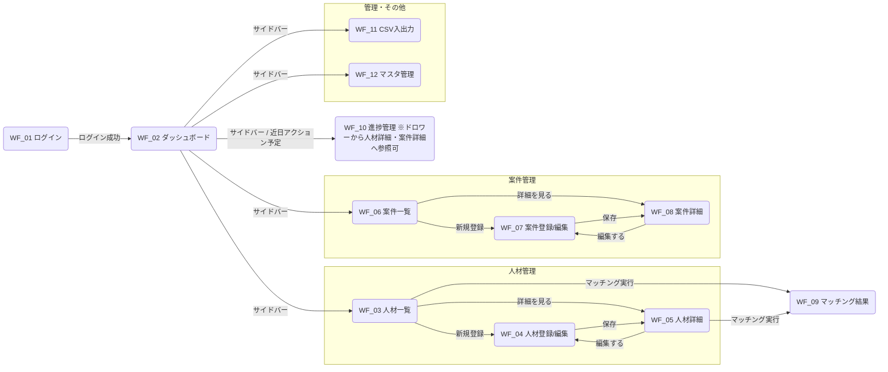

# 画面一覧・遷移図

**システム名：** 国内SES向け 人材・案件マッチングシステム  
**作成日：** 2026-04-23  
**最終更新：** 2026-04-27  
**作成者：** 岡大貴  
**ステータス：** 基本設計中（QA未確定項目あり・TBD明記）

---

## 凡例

| 記号 | 意味 |
|------|------|
| ※QA#XX 未確定 | 仕様QA表の該当番号が未回答であり、仕様が確定していないことを示す |
| （確定） | 仕様QA表で回答済み・確定済みであることを示す |
| Must | 4人月スコープINの必須機能 |
| Should | あれば良し、または簡易版で代替可能な機能 |

---

## アクター定義

| アクター | 説明 |
|---------|------|
| 一般営業 | SES営業担当者・コーディネーター。人材・案件の参照・登録・編集が可能 |
| 管理者 | 一般営業の全権限に加え、物理削除・アカウント管理・タグマスタ管理が可能 |
| システム | 人間操作を介さない自動処理（Python AIエンジン、Laravelバックグラウンド処理） |

---

## 画面遷移図（概要）

> **補足：** 全認証済み画面からサイドバーで各メイン画面へ遷移可能。ログアウトも全画面共通のため図上は省略。

---

## 画面一覧表

### 01 ログイン画面

| 項目 | 内容 |
|------|------|
| **画面No** | 01 |
| **画面名** | ログイン画面 |
| **URL** | `/login` |
| **主なアクター** | 一般営業、管理者 |
| **画面の役割** | システムへの認証エントリーポイント。未認証ユーザーはすべてこの画面にリダイレクトされる |
| **主要コンポーネント／UI要素** | メールアドレス入力欄 / パスワード入力欄 / ログインボタン |
| **遷移元** | 全画面（未認証リダイレクト） |
| **遷移先** | 02 ダッシュボード（認証成功後） |
| **機能要件** | Must: メールアドレス・パスワードによる認証 / Must: 認証失敗時エラーメッセージ表示 / Must: 認証成功後ダッシュボードへリダイレクト |
| **備考・TBD** | ログインIDは社内メールアドレスのみ許可（確定）。パスワードリセットは管理者が手動再設定（確定）。自動メール送信機能は対象外 |

---

### 02 ダッシュボード

| 項目 | 内容 |
|------|------|
| **画面No** | 02 |
| **画面名** | ダッシュボード |
| **URL** | `/dashboard` |
| **主なアクター** | 一般営業、管理者 |
| **画面の役割** | ログイン後のトップ画面。各機能へのハブとなり、業務上重要な情報をサマリー表示する |
| **主要コンポーネント／UI要素** | サマリーカード群 / サイドバーナビゲーション / 近日アクション予定一覧 / 進捗管理を見るリンク |
| **遷移元** | 01 ログイン（認証成功後）/ サイドバーナビ |
| **遷移先** | 03 人材一覧 / 06 案件一覧 / 10 進捗管理（サイドバー・近日アクション予定リンク）/ 11 CSV入出力 / 12 マスタ管理 |
| **機能要件** | Must: サイドバーナビゲーション表示 / Should: KPI・サマリー情報表示（提案可能人材数・稼働中案件数・進行中カード数等）/ Should: 近日アクション予定一覧表示 |
| **備考・TBD** | 表示内容はチームから提案・クライアント合意済み（QA#53確定）。近日アクション予定から進捗管理への遷移リンクあり |

---

### 03 人材一覧

| 項目 | 内容 |
|------|------|
| **画面No** | 03 |
| **画面名** | 人材一覧 |
| **URL** | `/engineers` |
| **主なアクター** | 一般営業、管理者 |
| **画面の役割** | 登録済み人材をカード形式で一覧表示する。絞り込み・検索・条件保存が可能なメイン検索画面 |
| **主要コンポーネント／UI要素** | 人材カード一覧 / スキル・勤務形態・ステータスフィルタ / 保存済み条件の呼び出しメニュー（常時表示、押した項目の条件を即適用）/ 条件保存ボタン（絞り込みがある時のみ表示。条件クリアボタンの左隣）/ 条件管理ボタン（保存済み条件の一覧・削除、常時表示）/ 新規登録ボタン / 条件クリアボタン |
| **遷移元** | 02 ダッシュボード / サイドバーナビ |
| **遷移先** | 04 人材登録・編集（新規登録ボタン）/ 05 人材詳細（カードクリック）/ 09 マッチング結果（マッチング実行ボタン）（確定） |
| **機能要件** | Must: カード形式での人材一覧表示 / Must: スキル・勤務形態・ステータスによるフィルタリング / Must: 新規登録への遷移 / Must: 一覧からのマッチング実行（確定）/ Should: 絞り込み条件の保存・呼び出し / Should: 全項目を対象とした検索（確定） |
| **備考・TBD** | マッチング実行は人材一覧・人材詳細の2か所から可能（QA#51確定）。ステータスフィルタの選択肢は提案可 / 面談中 / 提案不可の3択（QA#69確定） |
|  | > **【2026-08-19 修正】保存済み条件の呼び出しUIをメニュー化し、条件保存ボタンを条件クリアボタンの左隣へ移した（人材一覧・案件一覧の共通変更）。** > **背景：** 呼び出しUIをセレクト（値を保持するフォーム部品）で実装していたが、適用中の条件はUIの外（絞り込みタグ）にあり適用後の手編集でズレるため、適用中の条件を削除すると空表示で固まる・同じ条件を選び直しても発火しない、といった副作用が構造的に生じていた。また条件保存ボタンが右クラスタにあり、絞り込みの有無で出没するたび隣の条件管理ボタンが横にズレていた。 > **理由：** 呼び出しは「値の選択」ではなく「押すと適用されるアクション」であるためメニューに置き換える。条件保存・条件クリアはどちらも現在の絞り込み条件に作用するため隣接させ、常時表示の右クラスタをリフローさせない。（issue #66） |

---

### 04 人材登録・編集

| 項目 | 内容 |
|------|------|
| **画面No** | 04 |
| **画面名** | 人材登録・編集 |
| **URL** | `/engineers/create`（新規）/ `/engineers/{id}/edit`（編集） |
| **主なアクター** | 一般営業、管理者 |
| **画面の役割** | 人材情報の新規登録および既存データの編集を行うフォーム画面 |
| **主要コンポーネント／UI要素** | 基本情報フォーム（氏名・年齢・最寄り駅等）/ スキル・経験年数入力（複数追加）/ 工程経験チェックボックス / 勤務形態タグ選択 / アピールポイント入力欄 / 保存・キャンセルボタン |
| **遷移元** | 03 人材一覧（新規）/ 05 人材詳細（編集） |
| **遷移先** | 05 人材詳細（保存成功後）/ 03 人材一覧（新規登録キャンセル）/ 05 人材詳細（編集キャンセル） |
| **機能要件** | Must: 基本情報・スキル・工程経験の入力 / Must: スキルの複数追加・削除 / Must: 保存・バリデーション / Must: アピールポイント（appeal_note）の入力 / Should: 保存時に AI が appeal_note からプロフィール要約を生成（登録時＝入力あり、編集時＝appeal_note 変更時） |
| **備考・TBD** | 最寄り駅はフリーテキストまたは静的マスタ（QA#59確定）。必須・任意項目の動的変更はマスタ管理画面で管理者が設定（QA#65確定）。顔写真は不要（確定）。※QA#60 未確定：所属区分の管理要否。※QA#61 未確定：通勤許容時間の項目要否と選択肢 |
|  | > **【2026-08-07 修正】職務経歴書ファイル添付・スキルタグ抽出・「職務経歴要約」の記述を削除／訂正。** > **背景：** 旧設計（v0.3 以前）の職務経歴書ファイル機能は QA#13/#85 で廃止され、AI 要約の入力源は appeal_note（アピールポイント）に置換された（スコアリングロジック設計書 v0.4・AIプロンプト設計書 §4.3）。本表に旧記述が残存していた。 > **理由：** 実装（AI要約は appeal_note のみを入力とし、Python E2 で生成）と #12 設計に一致させるため。スキルタグ抽出は廃止（スキルはフォームのフリーテキスト入力）。 |

---

### 05 人材詳細

| 項目 | 内容 |
|------|------|
| **画面No** | 05 |
| **画面名** | 人材詳細 |
| **URL** | `/engineers/{id}` |
| **主なアクター** | 一般営業、管理者 |
| **画面の役割** | 人材1名の全情報を表示する読み取り専用画面。編集・マッチング実行・削除への導線を持つ |
| **主要コンポーネント／UI要素** | 人材プロフィールカード（氏名・年齢・最寄り駅・ステータス・スキル・工程経験等）/ 担当営業表示（メイン・サブ）/ AI要約表示エリア / 編集ボタン / マッチング実行ボタン / 削除ボタン（管理者のみ表示） |
| **遷移元** | 03 人材一覧（カードクリック）/ 10 進捗管理（ドロワー内人材名リンク） |
| **遷移先** | 04 人材登録・編集（編集ボタン）/ 09 マッチング結果（マッチング実行ボタン）/ 03 人材一覧（物理削除後、管理者のみ） |
| **機能要件** | Must: 全人材情報の表示 / Must: 編集画面への遷移 / Must: マッチング実行（案件全件を対象にスコアリング）/ Must: 削除（管理者のみ物理削除。紐づくパイプライン件数を確認ダイアログで警告）/ Should: AI生成プロフィール要約の表示（appeal_note を入力源。※「職務経歴要約」は旧称、#12 で改称） |
| **備考・TBD** | 担当営業は複数名（メイン・サブ）対応（確定）。削除は管理者のみ物理削除、一般営業はステータス変更で対応（確定）。ステータスは提案可 / 面談中 / 提案不可の3択（QA#69確定） |

---

### 06 案件一覧

| 項目 | 内容 |
|------|------|
| **画面No** | 06 |
| **画面名** | 案件一覧 |
| **URL** | `/projects` |
| **主なアクター** | 一般営業、管理者 |
| **画面の役割** | 登録済み案件をカード形式で一覧表示する。絞り込み・条件保存が可能なメイン案件検索画面 |
| **主要コンポーネント／UI要素** | 案件カード一覧 / 勤務形態・ステータスフィルタ / 保存済み条件の呼び出しメニュー（常時表示、押した項目の条件を即適用）/ 条件保存ボタン（絞り込みがある時のみ表示。条件クリアボタンの左隣）/ 条件管理ボタン（保存済み条件の一覧・削除、常時表示）/ 新規案件登録ボタン / 条件クリアボタン |
| **遷移元** | 02 ダッシュボード / サイドバーナビ |
| **遷移先** | 07 案件登録・編集（新規登録ボタン）/ 08 案件詳細（カードクリック） |
| **機能要件** | Must: カード形式での案件一覧表示 / Must: 勤務形態・ステータスによるフィルタリング / Must: 新規登録への遷移 / Should: 絞り込み条件の保存・呼び出し / Should: 全項目を対象とした検索（確定） |
| **備考・TBD** | ※QA#62 未確定：案件ステータスの選択肢・業務上の定義 |
|  | > **【2026-08-19 修正】保存済み条件の呼び出しUIをメニュー化し、条件保存ボタンを条件クリアボタンの左隣へ移した（人材一覧・案件一覧の共通変更）。** > **背景：** 呼び出しUIをセレクト（値を保持するフォーム部品）で実装していたが、適用中の条件はUIの外（絞り込みタグ）にあり適用後の手編集でズレるため、適用中の条件を削除すると空表示で固まる・同じ条件を選び直しても発火しない、といった副作用が構造的に生じていた。また条件保存ボタンが右クラスタにあり、絞り込みの有無で出没するたび隣の条件管理ボタンが横にズレていた。 > **理由：** 呼び出しは「値の選択」ではなく「押すと適用されるアクション」であるためメニューに置き換える。条件保存・条件クリアはどちらも現在の絞り込み条件に作用するため隣接させ、常時表示の右クラスタをリフローさせない。（issue #66） |

---

### 07 案件登録・編集

| 項目 | 内容 |
|------|------|
| **画面No** | 07 |
| **画面名** | 案件登録・編集 |
| **URL** | `/projects/create`（新規）/ `/projects/{id}/edit`（編集） |
| **主なアクター** | 一般営業、管理者 |
| **画面の役割** | 案件情報の新規登録および既存データの編集を行うフォーム画面 |
| **主要コンポーネント／UI要素** | 基本情報フォーム（案件名・顧客名・参画開始時期・商流・面談回数等）/ 必須スキル入力（スキル＋必要年数、複数追加）/ 尚可スキル入力（複数追加）/ 対象工程チェックボックス / 勤務形態・単価・勤務地入力 / 業務内容詳細テキストエリア / 保存・キャンセルボタン |
| **遷移元** | 06 案件一覧（新規）/ 08 案件詳細（編集） |
| **遷移先** | 08 案件詳細（保存成功後）/ 06 案件一覧（新規登録キャンセル）/ 08 案件詳細（編集キャンセル） |
| **機能要件** | Must: 全案件項目の入力・バリデーション / Must: 必須スキル・尚可スキルの複数追加・削除 / Must: 単価の数値（下限・上限）入力 / Must: 「スキル見合い」等テキスト入力の許容（確定）/ Should: 精算幅（時間下限・上限）項目（QA#66確定）/ Should: 稼働環境項目（QA#67確定） |
| **備考・TBD** | 単価はスキル見合いテキストも許容（確定）。担当営業は複数名（メイン・サブ）対応（確定）。最寄り駅はフリーテキストまたは静的マスタ（QA#59確定）。※QA#62 未確定：案件ステータスの選択肢・業務上の定義 |

---

### 08 案件詳細

| 項目 | 内容 |
|------|------|
| **画面No** | 08 |
| **画面名** | 案件詳細 |
| **URL** | `/projects/{id}` |
| **主なアクター** | 一般営業、管理者 |
| **画面の役割** | 案件1件の全情報を表示する読み取り専用画面。編集・削除への導線を持つ |
| **主要コンポーネント／UI要素** | 案件情報表示（必須スキル・尚可スキル・単価・勤務形態・工程・顧客折衝要否等）/ 担当営業表示（メイン・サブ）/ 編集ボタン / 削除ボタン（管理者のみ表示） |
| **遷移元** | 06 案件一覧（カードクリック）/ 10 進捗管理（ドロワー内案件名リンク） |
| **遷移先** | 07 案件登録・編集（編集ボタン）/ 06 案件一覧（物理削除後、管理者のみ） |
| **機能要件** | Must: 全案件情報の表示 / Must: 編集画面への遷移 / Must: 削除（管理者のみ物理削除） |
| **備考・TBD** | 担当営業は複数名（メイン・サブ）対応（確定）。削除は管理者のみ物理削除、一般営業は「クローズ」ステータス変更で対応（確定） |

---

### 09 マッチング結果画面

| 項目 | 内容 |
|------|------|
| **画面No** | 09 |
| **画面名** | マッチング結果画面 |
| **URL** | `/engineers/{engineerId}/matching` |
| **主なアクター** | 一般営業、管理者、システム（スコアリング） |
| **画面の役割** | 特定の人材に対するマッチングスコアリング結果を表示する。スコアリングはオンデマンド計算（DB保存なし）。結果からパイプラインへの登録が可能。追加後は同画面に留まり、続けて別案件を追加できる |
| **主要コンポーネント／UI要素** | 対象人材情報ヘッダー / **再マッチングボタン（ページヘッダー右）** / マッチング結果カード（案件名・スコア・ランク）/ スコア詳細ドロワー（AI推薦理由・不足条件・スコア内訳）/ パイプライン追加ボタン（追加後は同画面に留まり成功トーストを表示） |
| **遷移元** | 05 人材詳細（マッチング実行ボタン）/ 03 人材一覧（マッチング実行ボタン）（確定） |
| **遷移先** | なし（パイプライン追加後は同画面に留まる） |
| **機能要件** | Must: スコアリング結果の上位5件表示（確定）/ Must: AI推薦理由・不足条件の表示 / Must: スコア詳細ドロワー表示 / Must: パイプラインへの追加（同画面に留まり成功トースト表示）/ **Should: 明示操作による再マッチング（ヘッダーのボタンで AI を再実行し一覧を最新化。実行中は AI ローディングを表示し二重実行を防ぐ）**/ Should: AI出力フォーマット・文字数は特に要件なし（確定） |
| **備考・TBD** | スコアリングはオンデマンド計算・DB保存なし（確定）。表示件数は上位5件（QA#33確定）。マッチング方向は人材→案件の単方向のみ（確定）。パイプライン追加はマッチング経由のみ（確定）。パイプライン追加の初期ステータスは上位提案（QA#49確定）。AI処理は同期通信・5〜10秒以内（確定）。再マッチングは明示操作のみ（自動再実行はしない・#52確定）。※QA#31 確認中：スコアリング配点の最終確定 |

> **【2026-08-20 修正】URL を `/matching/{engineerId}` から `/engineers/{engineerId}/matching` に訂正**
> **背景：** 実装のルートは `routes/web.php` の `engineers/{engineer}/matching`（`engineers.matching`）で、旧 `/matching/{id}` は未定義ルートのため 404 になり廃止済み。本書だけが旧 URL のまま残っていた。
> **理由：** 再マッチング導線（#52）は「この画面と同じ URL への素の GET」を前提に設計しており、URL が実装と食い違ったままだと設計根拠が読めなくなるため。

> **【2026-08-20 確定】ページヘッダーに「再マッチング」ボタンを追加（#52）**
> **背景：** WF_09 はヘッダーに「アクションボタンを持たない」としていたが、一覧を最新化する手段がブラウザバック／F5 リロードしかなく、発見可能性が低かった。特にパイプライン追加が失敗した back では、サーバーが再スコアリングを行わない仕様（`preserve_matching_results`）のため古い状態の一覧が残り、ユーザーには復帰手段が見えなかった。
> **理由：** AI 再実行はコストが高く、スコアを保存しない（QA#45）ため実行のたびに並びが変わる。自動再実行は復活させず、ユーザーが望んだときだけ回せる明示的オプトインとしてヘッダーに常設する。実行中は初回ロードと同じ `AiLoadingOverlay` を出し、体験を統一する。

---

### 10 進捗管理画面（パイプライン）

| 項目 | 内容 |
|------|------|
| **画面No** | 10 |
| **画面名** | 進捗管理画面 |
| **URL** | `/pipelines` |
| **主なアクター** | 一般営業、管理者 |
| **画面の役割** | 人材×案件の提案〜成約までのパイプラインを管理する。進行中と完了済みをタブで分けて表示する |
| **主要コンポーネント／UI要素** | 進行中 / 完了済みタブ切り替え / パイプラインカード一覧（ステータスドロップダウン）/ フィルタ・ソート機能 / カード編集ドロワー（人材詳細・案件詳細への参照リンクを含む） |
| **遷移元** | 09 マッチング結果（パイプライン追加）/ 02 ダッシュボード（サイドバー・近日アクション予定リンク）/ サイドバーナビ |
| **遷移先** | 05 人材詳細（ドロワー内人材名リンク）/ 08 案件詳細（ドロワー内案件名リンク） |
| **機能要件** | Must: 進行中ステータス12種の一覧表示 / Must: 完了済みステータス4種の別タブ表示（確定）/ Must: カードのステータス変更（前後スキップ・巻き戻しともに許可）（QA#4確定）/ Must: ステータス変更権限は全ユーザー共通（QA#3確定）/ Must: カード詳細編集（顧客コメント・NG理由・次回アクション予定日等）（QA#54確定）/ Must: ドロワーから人材詳細・案件詳細への参照 / Should: フィルタ・ソート / Should: 次回アクション予定日超過アラートは不要（QA#6確定） |
| **備考・TBD** | 進行中ステータス12種・完了済み4種は確定（QA#2確定）。ステータスの操作主体は人材担当営業（QA#7確定）。完了済みから進行中への復帰は不可（QA#64確定）。削除は管理者のみ物理削除可能・一般営業は削除不可（QA#71確定）。※QA#62 未確定：各ステータスの業務上の定義。※QA#70 未確定：サブ担当カードの表示・管理者の初期表示範囲 |

> **【2026-07-02 修正】URL を `/pipeline` → `/pipelines`（複数形）に統一。**
> **背景：** 本ドキュメントは `/pipeline`（単数）と記載していたが、API設計書「06_進捗管理_APIエンドポイント一覧.md」は一貫して `/pipelines`（複数）で定義されており、両者が食い違っていた。
> **理由：** Laravel の `Route::resource` はリソース名を複数形で扱う規約であり、既存の `/engineers`・`/projects` も複数形で統一されている。エンドポイント定義の正本である API設計書、および Laravel の規約・既存実装との整合を優先し、複数形 `/pipelines` に統一した。（進捗管理機能 実装作業 `.steering/20260702-pipeline-management/` にて確定）

---

### 11 CSV入出力画面

| 項目 | 内容 |
|------|------|
| **画面No** | 11 |
| **画面名** | CSV入出力画面 |
| **URL** | `/csv` |
| **主なアクター** | 一般営業、管理者 |
| **画面の役割** | 人材・案件データのCSVエクスポート・インポートを提供する管理補助画面 |
| **主要コンポーネント／UI要素** | 人材CSVタブ / 案件CSVタブ / CSVエクスポートボタン（絞り込み条件付き）/ CSVインポートフォーム（ファイル選択・アップロード）/ インポート結果フィードバック表示 |
| **遷移元** | サイドバーナビ |
| **遷移先** | なし（同画面内で処理完結） |
| **機能要件** | Must: 人材CSVエクスポート（確定）/ Must: 人材CSVインポート（確定）/ Must: 案件CSVエクスポート（確定）/ Must: 案件CSVインポート（確定） |
| **備考・TBD** | CSV対象は人材・案件の両方（QA#15確定）。操作ログ機能は不要（QA#21・55・56・57・58 確定） |

---

### 12 マスタ管理画面

| 項目 | 内容 |
|------|------|
| **画面No** | 12 |
| **画面名** | マスタ管理画面 |
| **URL** | `/master` |
| **主なアクター** | 管理者（一般営業はアクセス不可） |
| **画面の役割** | スキルタグマスタ・ユーザーアカウント・フォーム設定の管理を行う管理者専用画面 |
| **主要コンポーネント／UI要素** | スキルタグタブ（タグ一覧・新規追加・編集・削除）/ ユーザー管理タブ（アカウント一覧・新規追加・編集・削除）/ フォーム設定タブ（人材・案件登録フォームの必須/任意切替） |
| **遷移元** | サイドバーナビ（管理者のみ表示） |
| **遷移先** | なし（同画面内で処理完結） |
| **機能要件** | Must: スキルタグのCRUD（管理者のみ）/ Must: ユーザーアカウントのCRUD（管理者のみ）/ Must: ユーザー登録項目：メールアドレス・パスワード・権限・氏名（確定）/ Must: フォームの必須/任意設定変更（管理者のみ）（QA#65確定）/ Should: スキルタグの並び順変更 |
| **備考・TBD** | スキルタグ管理権限は管理者のみ（確定）。ユーザー登録項目はメールアドレス・パスワード・権限・氏名（QA#18・68確定）。パスワードリセットは管理者が手動で再設定（確定）。権限は管理者/一般営業の2階層のみ（QA#17確定） |

---

## システム画面（12画面に含まない）

> **【2026-08-15 追記】共通エラーページを追加した。**
> **背景：** 404 / 403 / 419 / 500 に到達したとき、フレームワーク既定の応答（本番相当では素の白ページ）が表示され、アプリへ戻る導線が無かった（issue #70）。
> **理由：** 業務画面ではなく、どの画面からでも到達しうる受け皿であるため、**12画面の定義には含めず**システム画面として別途記載する。12画面の一覧・遷移定義自体は変更していない。

| 項目 | 内容 |
|------|------|
| **画面名** | 共通エラーページ |
| **URL** | 固定 URL なし（任意の URL でエラー発生時に描画。Inertia コンポーネント `Error`） |
| **主なアクター** | 全ユーザー（未ログインでも表示される） |
| **画面の役割** | 404 / 403 / 500 / 503 を、アプリの体裁を保った案内と復帰導線つきで表示する |
| **主要コンポーネント／UI要素** | ステータス別のアイコン・見出し・説明（マッチング結果の空状態と同じ表現）。未認証時のみログイン画面へのリンク |
| **遷移元** | 任意の画面・URL（打ち間違い・古いブックマーク・削除済み対象の URL・権限の無い画面への直接アクセス等） |
| **遷移先** | 認証済み：サイドバーから各画面へ（ページ内に専用ボタンは置かない）／未認証：ログイン画面（ボタン） |
| **備考** | HTTP ステータスコードは元の値のまま返す。419（セッション期限切れ）は本画面を出さずログイン画面へ誘導する。表示仕様の詳細は `docs/validation_error/バリデーション・エラー表示設計書.md` を参照 |

---

## パイプラインステータス一覧（参考）

### 進行中ステータス（12種）

| # | ステータス名 | 業務上の定義 |
|---|------------|------------|
| 1 | 上位提案 | ※QA#62 未確定 |
| 2 | 求職者応募済み | ※QA#62 未確定 |
| 3 | 応募中 | ※QA#62 未確定 |
| 4 | 一次調整中 | ※QA#62 未確定 |
| 5 | 一次待ち | ※QA#62 未確定 |
| 6 | 一次結果待ち | ※QA#62 未確定 |
| 7 | 最終調整中 | ※QA#62 未確定 |
| 8 | 最終待ち | ※QA#62 未確定 |
| 9 | 最終結果待ち | ※QA#62 未確定 |
| 10 | オファー | ※QA#62 未確定 |
| 11 | アサイン承諾待ち | ※QA#62 未確定 |
| 12 | 成約 | ※QA#62 未確定 |

### 完了済みステータス（4種）

| # | ステータス名 | 意味 |
|---|------------|-----|
| 1 | 不成立 | 選考落選（QA#63確定） |
| 2 | 募集終了 | 案件側のクローズ（QA#63確定） |
| 3 | アサイン辞退 | 成約後の辞退（QA#63確定） |
| 4 | 辞退 | 選考途中での求職者辞退（QA#63確定） |

> **遷移ルール（確定）：** 前後スキップ・巻き戻しともに許可（QA#4確定）。ステータス変更権限は全ユーザー共通（QA#3確定）。完了済みカードは別タブで表示（QA#5確定）。操作主体は人材担当営業（QA#7確定）。完了済みから進行中への復帰は不可（QA#64確定）。

---

*本ドキュメントは仕様QA表と連動して管理する。QA回答が出次第、該当のTBD記述を更新すること。*
